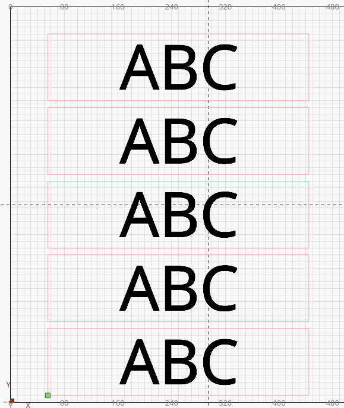
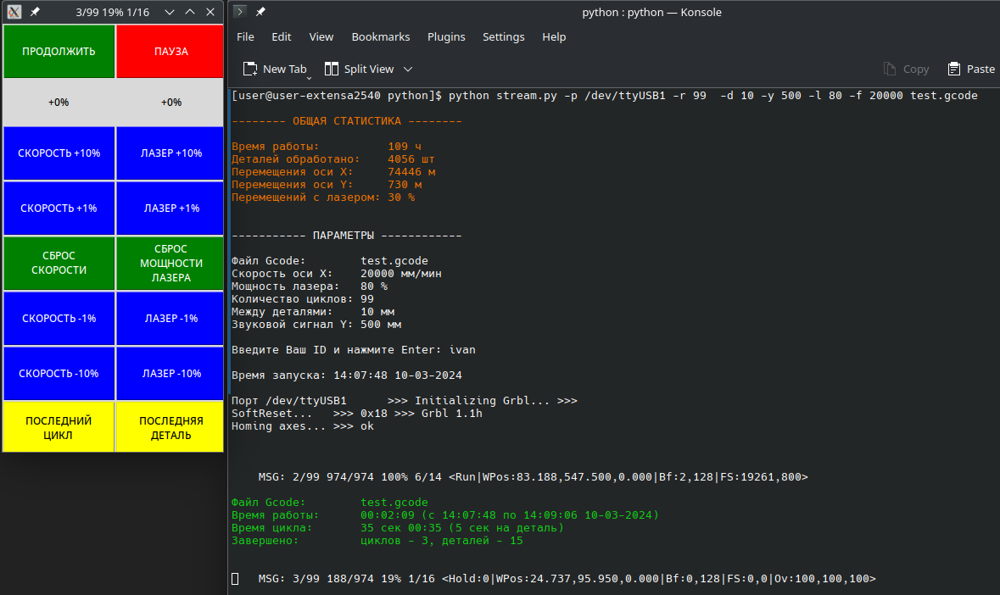
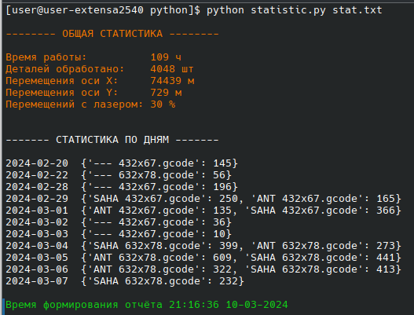

# Сценарий python циклической отправки команд в прошивку GRBL

Для работы с большим количеством повторяющихся деталей удобно использовать циклическую обработку.
Возможность циклической обработки присутствует в [LaserGRBL](https://github.com/arkypita/LaserGRBL), но в ней отсутствует сигнализация о завершении очередного цикла. Оператору необходимо постоянно следить за прогрессом выполнения, что крайне неудобно.

Данный сценарий позволяет выполнять циклическую обработку со своевременным звуковым уведомлением о необходимости замены деталей.

Сценарий основан на [описании интерфейса](https://github.com/gnea/grbl/blob/master/doc/markdown/interface.md) и файле [stream.py](https://github.com/gnea/grbl/blob/master/doc/script/stream.py) из репозитория [GRBL](https://github.com/gnea/grbl).  
В виду своей простоты сценарий может быть запущен на любой системе с интерпретатором Python.  
Сценарий проверен в Windows 7 (python 3.8) и Archlinux (python 3.11) с лазерным гравером [Sculpfun S30 Ultra-33W](https://sculpfun.com/products/sculpfun-s30-ultra-33w-laser-engraving-machine) (версия GRBL 1.1h) через USB и Bluetooth.

 

## Функционал:
- **циклическое выполнение** программы без остановок
- **звуковой сигнал** на заданной координате для своевременной замены деталей
- калибровка осей перед началом работы, а так же через заданное количество циклов
- подмена мощности лазера (S) и скорости осей (F) при старте
- изменение мощности лазера и скорости осей во время работы
- пауза и продолжение работы
- сбор статистики
- вывод текущей статистики
- вывод статистики по дням

## Параметры прошивки
Рекомендуется задать следующие [параметры прошивки GRBL](https://github.com/gnea/grbl/blob/master/doc/markdown/settings.md):
- $1 = 255 **Step idle delay** : Всегда держать моторы включёнными, иначе возможно смещение осей
- $21 = 0 **Hard limits** : Отключить концевики обнуления во время работы, чтобы исключить аварийную остановку при случайном касании концевиков
- $110, $111 **Max rate**, mm/min : Подберите максимальные скорости перемещения осей X и Y при обеспечении требуемого качества обработки
- $120, $121 **Acceleration**, mm/sec^2 : Подберите максимальные ускорения осей X и Y при обеспечении требуемого качества обработки
- $11 - **Junction deviation**, mm : Подберите параметры 'рывка'. При работе только с заполнением можно задать 0.001

## Запуск сценария в Windows
- Установите интерпретатор [python](https://www.python.org/)
- Установите библиотеку `pip install colorama`
- Определите номер порта через диспетчер устройств
- Создайте копию файла **test.cmd** и проверьте параметры внутри файла
- Запустите новый файл **.cmd**

## Запуск сценария в GNU/Linux
- Установите интерпретатор [python](https://www.python.org/)
- Установите библиотеку `pip install colorama`
- Определите номера порта выполнив команду `ls /dev/ttyUSB*` или `lspci`

## Основные параметры
- **-p** --port : Последовательный порт
- **-r** --repeats : Количество циклов
- **-d** --pieces_distance : Расстояние между деталями (мм)
- **-y** --y_beep : Звуковой сигнал при достижении координаты осью Y (мм)
- **-l** --laser : Подмена мощности лазера (S)
- **-f** --speed : Подмена скорости осей (F)
- **-h** --home : Калибровка осей в начале
- **-x** --home_cycles : Калибровка осей через заданное количество циклов

## Звуковой сигнал
Звуковой сигнал может быть инициирован по координате оси Y или метке в файле gcode:  
`; beep`  

Для воспроизведения звукового сигнала можно использовать любой консольный проигрыватель, например [ffplay](https://ffmpeg.org/ffplay.html) из пакета ffmpeg  
`ffplay -nodisp -hide_banner -loglevel error -autoexit alarm.oga`  
или [mpv](https://mpv.io/installation/)  
`mpv --no-terminal alarm.oga    `

## Пример команд запуска сценария
`python stream.py -r 99 -d 10 -y 500 test.gcode`

## Статистика
В файл статистики сохраняются следующие данные после завершения каждого цикла:
- время начала и завершения цикла
- имя файла gcode
- количество деталей
- имя работника
- пробег осей

Для вывода статистики выполните команду: `python statistic.py stat.txt`  

